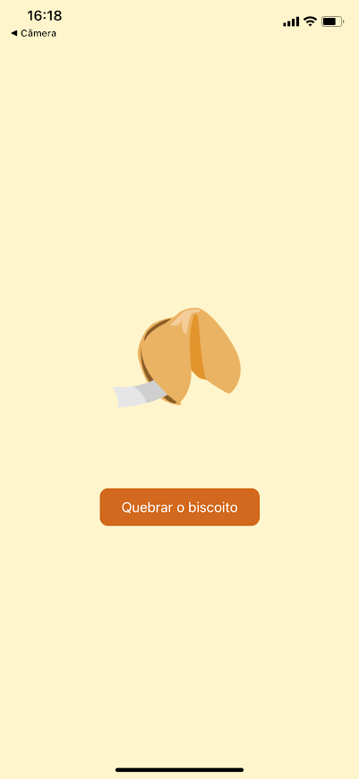
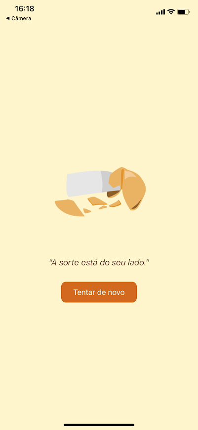

## 📄 `README.md` para projeto local com `fortune.js`

```md
# Fortune Cookie App 🍪

Aplicativo simples feito com React Native (Expo) onde o usuário “quebra” um biscoito da sorte e recebe uma frase positiva aleatória. As frases estão armazenadas localmente.

---

## 📱 Funcionalidades

- Exibe um biscoito fechado
- Ao clicar em "Quebrar Biscoito", a imagem muda para um biscoito aberto
- Mostra uma frase positiva aleatória

---

## 💾 Fonte de dados

As frases estão localmente no arquivo:

```

/fortune.js

````

```js
export const fortunes = [
  "Você terá um dia incrível!",
  "Grandes oportunidades estão a caminho.",
  "A sorte está do seu lado.",
  "Seu esforço será recompensado em breve.",
  "Hoje é um bom dia para começar algo novo.",
];
````

---

## 🛠 Tecnologias usadas

* [React Native](https://reactnative.dev/)
* [Expo](https://expo.dev/)
* JavaScript

---

## 🚀 Como rodar o projeto

1. Clone o repositório:

```bash
git clone https://github.com/emillyroar/fortune-cookie.git
cd fortune-cookie
```

2. Instale as dependências:

```bash
npm install
```

3. Inicie o app com Expo:

```bash
npx expo start
```

4. Escaneie o QR Code com o app **Expo Go** no seu celular.

---

## ✨ Imagens

### 🥠 Biscoito fechado


### 🍪 Biscoito aberto com frase


---


